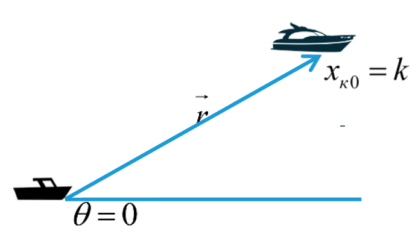
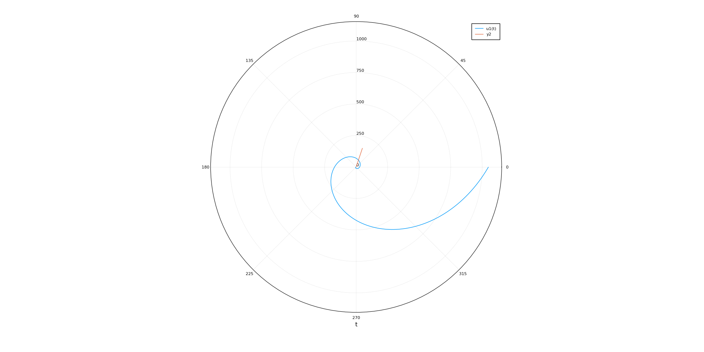

---
## Front matter
lang: ru-RU
title: "Лабораторная работа 2"
author: "Греков Максим Сергеевич"
institute: RUDN University, Moscow, Russian Federation
date: 2021 Москва

## Formatting
mainfont: PT Serif
romanfont: PT Serif
sansfont: PT Serif
monofont: PT Serif
toc: false
slide_level: 2
theme: metropolis
header-includes: 
 - \metroset{progressbar=frametitle,sectionpage=progressbar,numbering=fraction}
 - '\makeatletter'
 - '\beamer@ignorenonframefalse'
 - '\makeatother'
aspectratio: 43
section-titles: true
---

# Цель работы

## Цель работы

Рассмотреть задачу о погоне. 

Освоить базовые навыки работы с высокоуровневым языком программирования, созданным для математических вычислений - Julia.

Научиться с помощью него решать ДУ, строить графики, что позволит проектировать математичесие модели. 

# Постановка задачи

## Постановка задачи

На море в тумане катер береговой охраны преследует лодку браконьеров. Через определенный промежуток времени туман рассеивается, и лодка обнаруживается на расстоянии 19,1 км от катера. Затем лодка снова скрывается в тумане и уходит прямолинейно в неизвестном направлении. Известно, что скорость катера в 5,2 раза больше скорости браконьерской лодки.

Необходимо определить по какой траектории необходимо двигаться катеру, чтоб нагнать лодку.

# Решение задачи

## Решение задачи

1. Принимем за $t_0$ = 0, $x_{л0}$ = 0 - место нахождения лодки браконьеров в момент обнаружения, $x_{к0} = k$ - место нахождения катера береговой охраны относительно лодки браконьеров в момент обнаружения лодки.

## Решение задачи

2. Введем полярные координаты. Считаем, что полюс - это точка обнаружения лодки браконьеров $x_{л0}$ ($\theta = x_{л0} = 0$).

## Решение задачи

Полярная ось $r$ проходит через точку нахождения катера береговой охраны (рис. -@fig:001) нахождения катера береговой охраны.

{ #fig:001 width=80% }

## Решение задачи

3. Траектория катера должна быть такой, чтобы и катер, и лодка все время были на одном расстоянии от полюса $\theta$, только в этом случае траектория катера пересечется с траекторией лодки. 

## Решение задачи

Поэтому для начала катер береговой охраны должен двигаться некоторое время прямолинейно, пока не окажется на том же расстоянии от полюса, что и лодка браконьеров. После этого катер береговой охраны должен двигаться вокруг полюса удаляясь от него с той же скоростью, что и лодка браконьеров.

## Решение задачи

4. Чтобы найти расстояние $x$ (расстояние после которого катер начнет двигаться вокруг полюса), необходимо составить простое уравнение. Пусть через время $t$ катер и лодка окажутся на одном расстоянии от полюса. За это время лодка пройдет $x$, а катер $k-x$ (или $k+x$, в зависимости от начального положения катера относительно полюса). 

Время, за которое они пройдут это расстояние, вычисляется как $x/v$ или $k-x/2v$ (во втором случае $x+k/2v$). Так как время одно и то же, то эти величины одинаковы. 

## Решение задачи

Тогда неизвестное расстояние $x$ можно найти из следующего уравнения: 

$$
\frac{x}{v} = \frac{k - x}{nv} в первом случае или 
$$

$$
\frac{x}{v} = \frac{k + x}{nv} во втором.
$$

Отсюда мы найдем два значения  $x_1 = \frac{19.1}{6.2}$ и $x2 = \frac{19.1}{4.2}$ , задачу будем решать для двух случаев.

## Решение задачи

5. После того, как катер береговой охраны окажется на одном расстоянии от полюса, что и лодка, он должен сменить прямолинейную траекторию и начать двигаться вокруг полюса удаляясь от него со скоростью лодки $v$ . 

Для этого скорость катера раскладываем на две составляющие: $v_r$ - радиальная скорость и $v_{\tau}$ - тангенциальная скорость.

## Решение задачи

Радиальная скорость - это скорость, с которой катер удаляется от полюса

$$
v_r = \frac{dr}{dt}, 
$$

## Решение задачи

Тангенциальная скорость – это линейная скорость вращения катера относительно полюса

$$
v_{\tau} = r * \frac{d\theta}{dt}
$$

Так как $v_r$ = $v_{l}$, то $\frac{dr}{dt} = v_{l}$.

## Решение задачи

Из рисунка (учитывая, что радиальная скорость равна $v$ ) видно (рис. -@fig:002), что $v_{\tau} = \sqrt{4v^2 - v^2} = \sqrt{3}v$. 

{ #fig:002 width=80% }

## Решение задачи

6. Решение задачи сводится к решению системы из двух
дифференциальных уравнений:

$$
\begin{cases} 
\frac{dr}{dt} = v \\ 
\frac{d\theta}{dt} * r  = \sqrt{3}v \\ 
\end{cases}
$$

## Решение задачи

С начальными условиями $\begin{cases} \theta_0 = 0 \\ r_0 = 6.2  \end{cases}$ и $\begin{cases} \theta_1 = -\pi \\ r_1 = 4.2  \end{cases}$. 

Исключая из полученной системы производную по t, можно перейти к
следующему уравнению

$$
\frac{dr}{d\theta} = \frac{r}{\sqrt{3}}.
$$

# Результаты решения

## Результаты решения

{ #fig:003 width=80% }

## Результаты решения

{ #fig:004 width=80% }

# Вывод 

Рассмотрели задачу о погоне. 

Освоили базовые навыки работы с высокоуровневым языком программирования, созданным для математических вычислений - Julia.

Научились с помощью него решать ДУ, строить графики. 

## {.standout}
