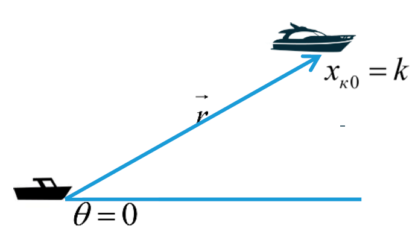
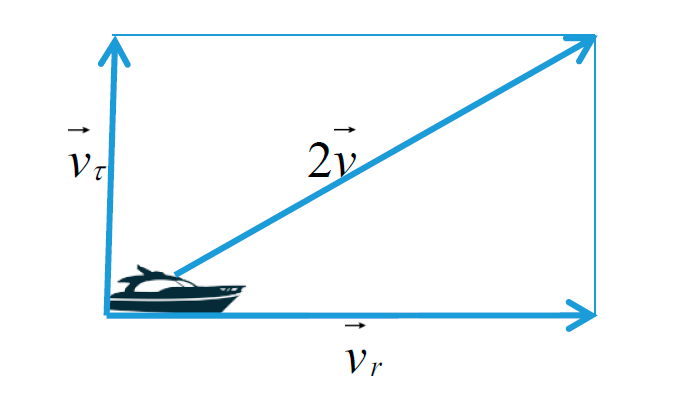
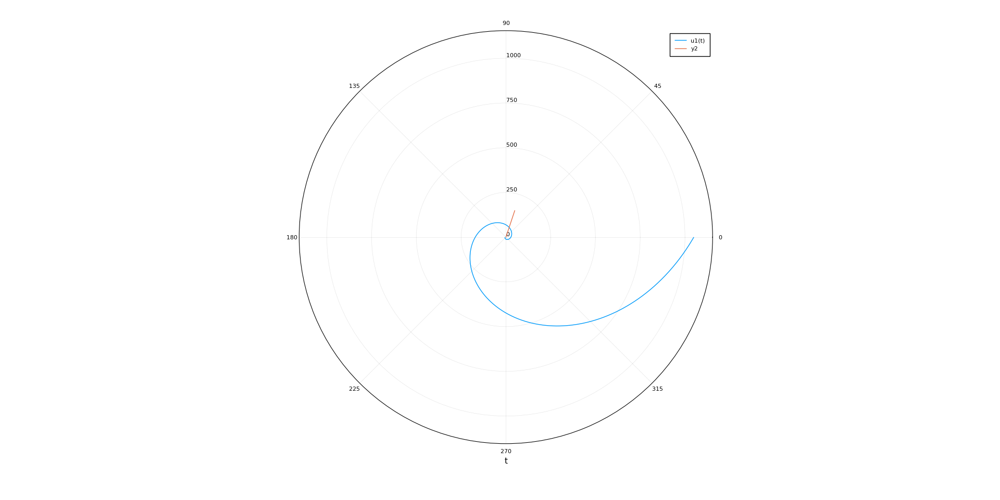

---
# Front matter
lang: ru-RU
title: "Лабораторная работа 2"
subtitle: "Задача о погоне"
author: "Греков Максим Сергеевич"

# Formatting
toc-title: "Содержание"
toc: true # Table of contents
toc_depth: 2
lof: true # List of figures
lot: false # List of tables
fontsize: 12pt
linestretch: 1.5
papersize: a4paper
documentclass: scrreprt
polyglossia-lang: russian
polyglossia-otherlangs: english
mainfont: PT Serif
romanfont: PT Serif
sansfont: PT Serif
monofont: PT Serif
mainfontoptions: Ligatures=TeX
romanfontoptions: Ligatures=TeX
sansfontoptions: Ligatures=TeX,Scale=MatchLowercase
monofontoptions: Scale=MatchLowercase
indent: true
pdf-engine: lualatex
header-includes:
  - \linepenalty=10 # the penalty added to the badness of each line within a paragraph (no associated penalty node) Increasing the value makes tex try to have fewer lines in the paragraph.
  - \interlinepenalty=0 # value of the penalty (node) added after each line of a paragraph.
  - \hyphenpenalty=50 # the penalty for line breaking at an automatically inserted hyphen
  - \exhyphenpenalty=50 # the penalty for line breaking at an explicit hyphen
  - \binoppenalty=700 # the penalty for breaking a line at a binary operator
  - \relpenalty=500 # the penalty for breaking a line at a relation
  - \clubpenalty=150 # extra penalty for breaking after first line of a paragraph
  - \widowpenalty=150 # extra penalty for breaking before last line of a paragraph
  - \displaywidowpenalty=50 # extra penalty for breaking before last line before a display math
  - \brokenpenalty=100 # extra penalty for page breaking after a hyphenated line
  - \predisplaypenalty=10000 # penalty for breaking before a display
  - \postdisplaypenalty=0 # penalty for breaking after a display
  - \floatingpenalty = 20000 # penalty for splitting an insertion (can only be split footnote in standard LaTeX)
  - \raggedbottom # or \flushbottom
  - \usepackage{float} # keep figures where there are in the text
  - \floatplacement{figure}{H} # keep figures where there are in the text
---

# Цель работы

Рассмотреть задачу о погоне. 

Освоить базовые навыки работы с высокоуровневым языком программирования, созданным для математических вычислений - Julia.

Научиться с помощью него решать ДУ, строить графики, что позволит проектировать математичесие модели. 

# Выполнение лабораторной работы

## Постановка задачи

### Задача о погоне

На море в тумане катер береговой охраны преследует лодку браконьеров. Через определенный промежуток времени туман рассеивается, и лодка обнаруживается на расстоянии 19,1 км от катера. Затем лодка снова скрывается в тумане и уходит прямолинейно в неизвестном направлении. Известно, что скорость катера в 5,2 раза больше скорости браконьерской лодки.

Необходимо определить по какой траектории необходимо двигаться катеру, чтоб нагнать лодку.

## Решение задачи

1. Принимем за $t_0$ = 0, $x_{л0}$ = 0 - место нахождения лодки браконьеров в момент обнаружения, $x_{к0} = k$ - место нахождения катера береговой охраны относительно лодки браконьеров в момент обнаружения лодки.
2. Введем полярные координаты. Считаем, что полюс - это точка обнаружения лодки браконьеров $x_{л0}$ ($\theta = x_{л0} = 0$), а полярная ось $r$ проходит через точку нахождения катера береговой охраны (рис. -@fig:001) нахождения катера береговой охраны.

{ #fig:001 width=80% }

3. Траектория катера должна быть такой, чтобы и катер, и лодка все время были на одном расстоянии от полюса $\theta$, только в этом случае траектория катера пересечется с траекторией лодки. Поэтому для начала катер береговой охраны должен двигаться некоторое время прямолинейно, пока не окажется на том же расстоянии от полюса, что и лодка браконьеров. После этого катер береговой охраны должен двигаться вокруг полюса удаляясь от него с той же скоростью, что и лодка браконьеров.

4. Чтобы найти расстояние $x$ (расстояние после которого катер начнет двигаться вокруг полюса), необходимо составить простое уравнение. Пусть через время $t$ катер и лодка окажутся на одном расстоянии от полюса. За это время лодка пройдет $x$, а катер $k-x$ (или $k+x$, в зависимости от начального положения катера относительно полюса). Время, за которое они пройдут это расстояние, вычисляется как $x/v$ или $k-x/2v$ (во втором случае $x+k/2v$). Так как время одно и то же, то эти величины одинаковы. Тогда неизвестное расстояние $x$ можно найти из следующего уравнения: 

$$
\frac{x}{v} = \frac{k - x}{nv} в первом случае или 
$$

$$
\frac{x}{v} = \frac{k + x}{nv} во втором.
$$

Отсюда мы найдем два значения  $x_1 = \frac{19.1}{6.2}$ и $x2 = \frac{19.1}{4.2}$ , задачу будем решать для двух случаев.

5. После того, как катер береговой охраны окажется на одном расстоянии от полюса, что и лодка, он должен сменить прямолинейную траекторию и начать двигаться вокруг полюса удаляясь от него со скоростью лодки $v$ . Для этого скорость катера раскладываем на две составляющие: $v_r$ - радиальная скорость и $v_{\tau}$ - тангенциальная скорость.

Радиальная скорость - это скорость, с которой катер удаляется от полюса

$$
v_r = \frac{dr}{dt}, 
$$

Тангенциальная скорость – это линейная скорость вращения катера относительно полюса

$$
v_{\tau} = r * \frac{d\theta}{dt}
$$

Так как $v_r$ = $v_{l}$, то $\frac{dr}{dt} = v_{l}$.

Из рисунка (учитывая, что радиальная скорость равна $v$ ) видно (рис. -@fig:002), что $v_{\tau} = \sqrt{4v^2 - v^2} = \sqrt{3}v$. 

{ #fig:002 width=80% }

6. Решение задачи сводится к решению системы из двух
дифференциальных уравнений:

$$
\begin{cases} 
\frac{dr}{dt} = v \\ 
\frac{d\theta}{dt} * r  = \sqrt{3}v \\ 
\end{cases}
$$

С начальными условиями $\begin{cases} \theta_0 = 0 \\ r_0 = 6.2  \end{cases}$ и $\begin{cases} \theta_1 = -\pi \\ r_1 = 4.2  \end{cases}$. 

Исключая из полученной системы производную по t, можно перейти к
следующему уравнению

$$
\frac{dr}{d\theta} = \frac{r}{\sqrt{3}}.
$$

При написании программы на языке программирования Julia, получили следующие результаты:

{ #fig:003 width=80% }

{ #fig:004 width=80% }

# Вывод

Рассмотрели задачу о погоне. 

Освоили базовые навыки работы с высокоуровневым языком программирования, созданным для математических вычислений - Julia.

Научились с помощью него решать ДУ, строить графики. 