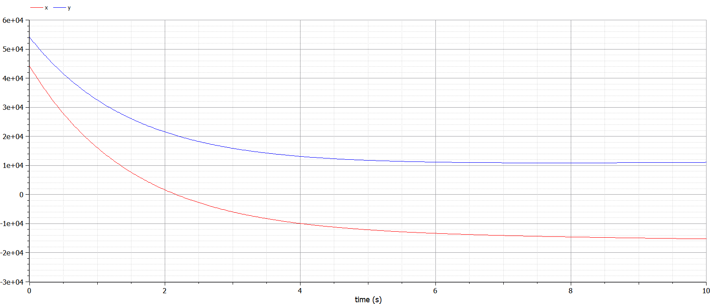

---
# Front matter
lang: ru-RU
title: "Лабораторная работа 3"
subtitle: "Модель боевых действий"
author: "Греков Максим Сергеевич"

# Formatting
toc-title: "Содержание"
toc: true # Table of contents
toc_depth: 2
lof: true # List of figures
lot: false # List of tables
fontsize: 12pt
linestretch: 1.5
papersize: a4paper
documentclass: scrreprt
polyglossia-lang: russian
polyglossia-otherlangs: english
mainfont: PT Serif
romanfont: PT Serif
sansfont: PT Serif
monofont: PT Serif
mainfontoptions: Ligatures=TeX
romanfontoptions: Ligatures=TeX
sansfontoptions: Ligatures=TeX,Scale=MatchLowercase
monofontoptions: Scale=MatchLowercase
indent: true
pdf-engine: lualatex
header-includes:
  - \linepenalty=10 # the penalty added to the badness of each line within a paragraph (no associated penalty node) Increasing the value makes tex try to have fewer lines in the paragraph.
  - \interlinepenalty=0 # value of the penalty (node) added after each line of a paragraph.
  - \hyphenpenalty=50 # the penalty for line breaking at an automatically inserted hyphen
  - \exhyphenpenalty=50 # the penalty for line breaking at an explicit hyphen
  - \binoppenalty=700 # the penalty for breaking a line at a binary operator
  - \relpenalty=500 # the penalty for breaking a line at a relation
  - \clubpenalty=150 # extra penalty for breaking after first line of a paragraph
  - \widowpenalty=150 # extra penalty for breaking before last line of a paragraph
  - \displaywidowpenalty=50 # extra penalty for breaking before last line before a display math
  - \brokenpenalty=100 # extra penalty for page breaking after a hyphenated line
  - \predisplaypenalty=10000 # penalty for breaking before a display
  - \postdisplaypenalty=0 # penalty for breaking after a display
  - \floatingpenalty = 20000 # penalty for splitting an insertion (can only be split footnote in standard LaTeX)
  - \raggedbottom # or \flushbottom
  - \usepackage{float} # keep figures where there are in the text
  - \floatplacement{figure}{H} # keep figures where there are in the text
---


# Цель работы

Рассмотреть некоторые простейшие модели боевых действий – модели Ланчестера.

Освоить базовые навыки работы с открытым программным обеспечением для моделирования, симуляции, оптимизации и анализа сложных динамических систем - OpenModelica.

Построить графики изменения численности войск армий в заданных случаях.

# Описание задачи

## Общее описание задачи

В противоборстве могут принимать участие как регулярные войска, так и партизанские отряды. В общем случае главной характеристикой соперников являются численности сторон. Если в какой-то момент времени одна из численностей обращается в нуль, то данная сторона считается проигравшей (при условии, что численность другой стороны в данный момент положительна).

## Постановка задачи

Между страной Х и страной У идет война. Численность состава войск исчисляется от начала войны, и являются временными функциями $x(t)$ и $y(t)$ . В начальный момент времени страна Х имеет армию численностью 44 200 человек, а в распоряжении страны У армия численностью в 54 100 человек. Для упрощения модели считаем, что коэффициенты $a,b,c,h$ постоянны. Также считаем $P(t)$ и $Q(t)$ непрерывные функции.

# Параметры модели

## Регулярные войска

Постройте графики изменения численности войск армии Х и армии У для следующих случаев:

1.	Модель боевых действий между регулярными войсками

$$
\frac{dx}{dy} = -0,312x(t) - 0,456y(t) + sin(t + 3)
$$
$$
\frac{dx}{dy} = -0,256x(t) - 0,34y(t) + cos(t + 7)
$$

## Регулярные войска и партизанские отряды

2.	Модель ведения боевых действий с участием регулярных войск и партизанских отрядов

$$
\frac{dx}{dt} = -0,318x(t) - 0,615y(t) + |cos(8t)| 
$$
$$
\frac{dy}{dt} = -0,312x(t)y(t) - 0,512y(t) + |sin(6t)|
$$

# Решение задачи

В первом случае	численность	регулярных войск определяется тремя факторами:

- скорость уменьшения численности войск из-за причин, не связанных с боевыми действиями (болезни, травмы, дезертирство);
- скорость потерь, обусловленных боевыми действиями противоборствующих сторон (что связанно с качеством стратегии, уровнем вооружения, профессионализмом солдат и т.п.);
- скорость поступления подкрепления (задаётся некоторой функцией от времени).

В этом случае модель боевых действий между регулярными войсками описывается следующим образом

$$
\frac{dx}{dt} = -a(t)x(t) - b(t)y(t) + P(t)
$$
$$
\frac{dy}{dt} = -c(t)x(t) - h(t)y(t) + Q(t)
$$

Потери, не связанные с боевыми действиями, описывают члены $-a(t)x(t)$ и $-h(t)y(t)$, члены $-b(t)y(t)$ и $-c(t)x(t)$ отражают потери на поле боя.

Коэффициенты $b(t)$ и $c(t)$ указывают на эффективность боевых действий со стороны у и х соответственно, $a(t),h(t)$ - величины, характеризующие степень влияния различных факторов на потери. 

Функции $P(t),Q(t)$ учитывают возможность подхода подкрепления к войскам Х и У в течение одного дня.

Во втором случае в борьбу добавляются партизанские отряды. 

Нерегулярные войска в отличии от постоянной армии менее уязвимы, так как действуют скрытно, в этом случае сопернику приходится действовать неизбирательно, по площадям, занимаемым партизанами. 

Поэтому считается, что тем потерь партизан, проводящих свои операции в разных местах на некоторой известной территории, пропорционален не только численности армейских соединений, но и численности самих партизан. 

В результате модель принимает вид:

$$
\frac{dx}{dt} = -a(t)x(t) - b(t)y(t) + P(t)
$$
$$
\frac{dy}{dt} = -c(t)x(t)y(t) - h(t)y(t) + Q(t)
$$

В этой системе все величины имею тот же смысл, что и в предыдущей системе.

В простейшей модели борьбы двух противников коэффициенты $b(t)$ и $c(t)$ являются постоянными. 

Попросту говоря, предполагается, что каждый солдат армии x убивает за единицу времени c солдат армии y (и, соответственно, каждый солдат армии y убивает b солдат армии x). 

Также не учитываются потери, не связанные с боевыми действиями, и возможность подхода подкрепления.

Состояние системы описывается точкой (x,y) положительного квадранта плоскости.

Координаты этой точки, x и y - это численности противостоящих армий. 

Тогда модель принимает вид

$$
\begin{cases} 
dx = -by \\
dy = -cx \\
\end{cases}
$$

Это - жесткая модель, которая допускает точное решение

$$
\frac{dx}{dy} = \frac{by}{cx}
$$

$cxdx = bydy, cx^2 - by^2 = C$

Эволюция численностей армий x и y происходит вдоль гиперболы, заданной этим уравнением (рис.1). По какой именно гиперболе пойдет война, зависит от начальной точки.

{ #fig:001 width=70% }

Эти гиперболы разделены прямой $\sqrt{c}x = \sqrt{b}y$. Если начальная точка лежит выше этой прямой, то гипербола выходит на ось y. 

Это значит, что в ходе войны численность армии x уменьшается до нуля (за конечное время). 

Армия y выигрывает, противник уничтожен.

Если начальная точка лежит ниже, то выигрывает армия x. 

В разделяющем эти случаи состоянии (на прямой) война заканчивается истреблением обеих армий.

Но на это требуется бесконечно большое время: конфликт продолжает тлеть, когда оба противника уже обессилены.

Вывод модели таков: для борьбы с вдвое более многочисленным противником нужно в четыре раза более мощное оружие, с втрое более многочисленным - в девять раз и т. д. (на это указывают квадратные корни в уравнении прямой).

Стоит помнить, что эта модель сильно идеализирована и неприменима к реальной ситуации. Но может использоваться для начального анализа.

Если рассматривать второй случай (война между регулярными войсками и партизанскими отрядами) с теми же упрощениями, то эта модель принимает вид:

$$
\frac{dx}{dt} = -by(t)
$$
$$
\frac{dy}{dt} = -cx(t)y(t)
$$

Эта система приводится к уравнению

$$
\frac{d}{dt}(\frac{b}{2}x^2(t)-cy(t))=0,
$$

которое при заданных начальных условиях имеет единственное решение:

$$
\frac{b}{2}x^2(t)-cy(t) = \frac{b}{2}x^2(0)-cy(0)=C_1
$$

{ #fig:002 width=70% }

Из рис. 2 видно, что при $C_1>0$ побеждает регулярная армия, при $C_1<0$ побеждают партизаны. 

Аналогично противоборству регулярных войск, победа обеспечивается не только начальной численностью, но и боевой выучкой и качеством вооружения. 

При $C_1>0$ получаем соотношение $\frac{b}{2}x^2(0)>cy(0)$.

Чтобы одержать победу партизанам необходимо увеличить коэффициент $c$ и повысить свою начальную численность на соответствующую величину. 

Причем это увеличение, с ростом начальной численности регулярных войск $(x(0))$ , должно расти не линейно, а пропорционально второй степени $x(0)$. 

Таким образом, можно сделать вывод, что регулярные войска находятся в более выгодном положении, так как неравенство для них выполняется прим меньшем росте начальной численности войск.

Рассмотренные простейшие модели соперничества соответствуют системам обыкновенных дифференциальных уравнений второго порядка, широко распространенным при описании многих естественно научных объектов.

# Результаты решения

{ #fig:003 width=100% }

{ #fig:004 width=60% }

{ #fig:005 width=100% }

# Код программы

## Модель боевых действий между регулярными войсками

### Модель

```
model var1
parameter Real a = 0.312;
parameter Real b = 0.456;
parameter Real c = 0.256;
parameter Real h = 0.34;

Real x(start = 44200);
Real y(start = 54100);

equation
  der(x) = -a * x - b * y + func1.P(time);
  der(y) = -c * x - h * y + func1.Q(time);
end var1;
```

### Функции

```
class func1

function P
  input Real t;
  output Real p;
algorithm
  p := sin(t+3);
end P;

function Q
  input Real t;
  output Real q;
algorithm
  q := cos(t+7);
end Q;

end func1;
```

## Модель ведение боевых действий с участием регулярных войск и партизанских отрядов

### Модель

```
model var2
parameter Real a = 0.318;
parameter Real b = 0.615;
parameter Real c = 0.312;
parameter Real h = 0.512;

Real x(start = 44200);
Real y(start = 54100);

equation
  der(x) = -a * x - b * y + func2.P(time);
  der(y) = -c * x * y - h * y + func2.Q(time);
end var2;
```

### Функции

```
class func2

function P
  input Real t;
  output Real p;
algorithm
  p := abs(cos(8*t));
end P;

function Q
  input Real t;
  output Real q;
algorithm
  q := abs(sin(6*t));
end Q;

end func2;
```

# Вывод 

Рассмотрели некоторые простейшие модели боевых действий – модели Ланчестера.

Освоили базовые навыки работы с открытым программным обеспечением для моделирования, симуляции, оптимизации и анализа сложных динамических систем - OpenModelica.

Построили графики изменения численности войск армий в заданных случаях.