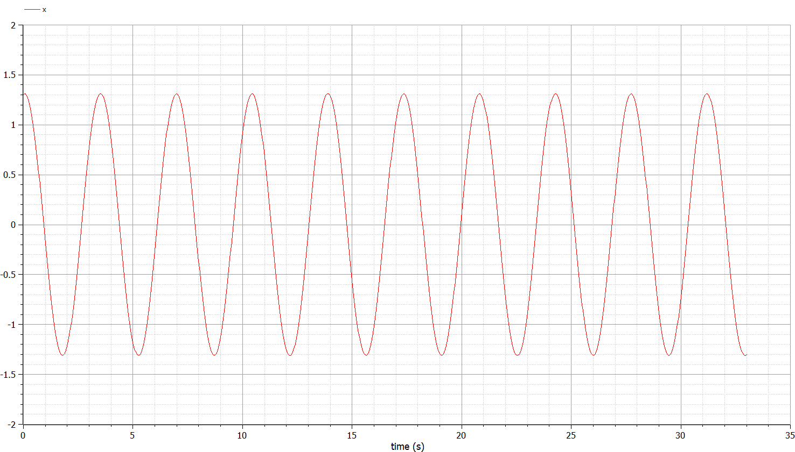
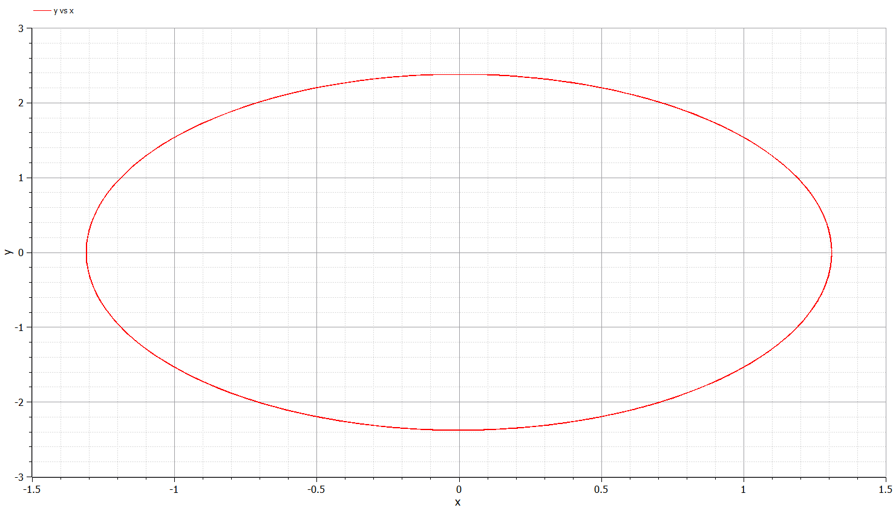
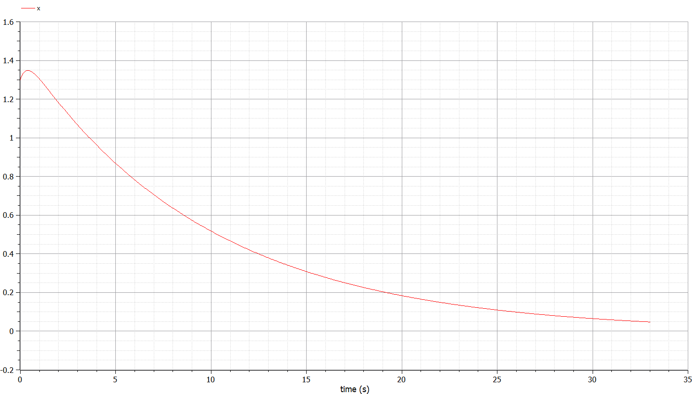
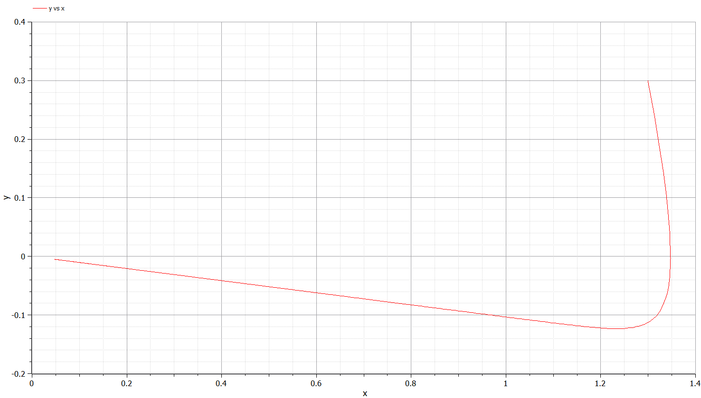
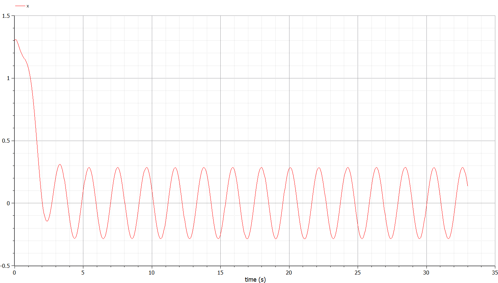
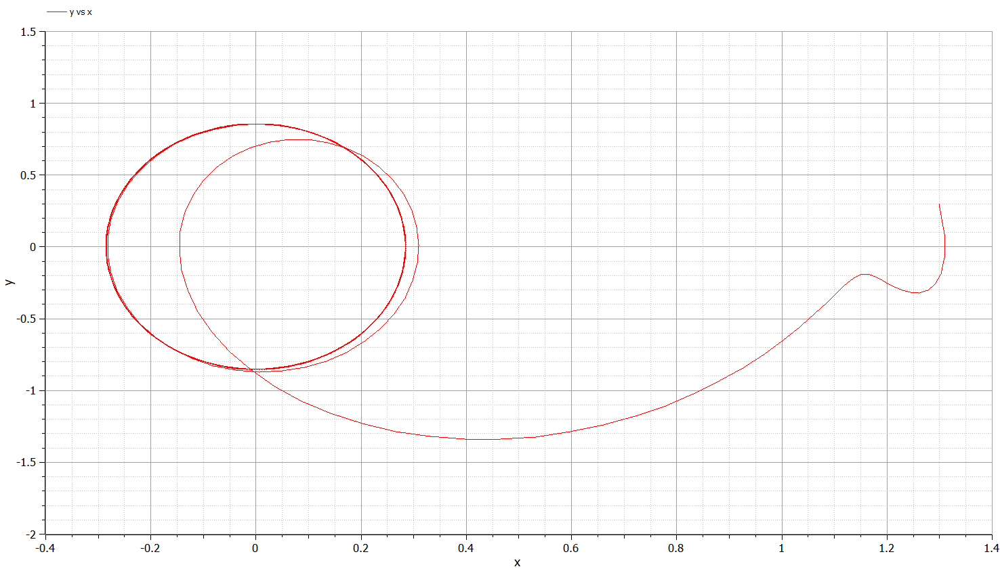

---
# Front matter
lang: ru-RU
title: "Лабораторная работа 4"
subtitle: "Модель гармонического осциллятора"
author: "Греков Максим Сергеевич"

# Formatting
toc-title: "Содержание"
toc: true # Table of contents
toc_depth: 2
lof: true # List of figures
lot: false # List of tables
fontsize: 12pt
linestretch: 1.5
papersize: a4paper
documentclass: scrreprt
polyglossia-lang: russian
polyglossia-otherlangs: english
mainfont: PT Serif
romanfont: PT Serif
sansfont: PT Serif
monofont: PT Serif
mainfontoptions: Ligatures=TeX
romanfontoptions: Ligatures=TeX
sansfontoptions: Ligatures=TeX,Scale=MatchLowercase
monofontoptions: Scale=MatchLowercase
indent: true
pdf-engine: lualatex
header-includes:
  - \linepenalty=10 # the penalty added to the badness of each line within a paragraph (no associated penalty node) Increasing the value makes tex try to have fewer lines in the paragraph.
  - \interlinepenalty=0 # value of the penalty (node) added after each line of a paragraph.
  - \hyphenpenalty=50 # the penalty for line breaking at an automatically inserted hyphen
  - \exhyphenpenalty=50 # the penalty for line breaking at an explicit hyphen
  - \binoppenalty=700 # the penalty for breaking a line at a binary operator
  - \relpenalty=500 # the penalty for breaking a line at a relation
  - \clubpenalty=150 # extra penalty for breaking after first line of a paragraph
  - \widowpenalty=150 # extra penalty for breaking before last line of a paragraph
  - \displaywidowpenalty=50 # extra penalty for breaking before last line before a display math
  - \brokenpenalty=100 # extra penalty for page breaking after a hyphenated line
  - \predisplaypenalty=10000 # penalty for breaking before a display
  - \postdisplaypenalty=0 # penalty for breaking after a display
  - \floatingpenalty = 20000 # penalty for splitting an insertion (can only be split footnote in standard LaTeX)
  - \raggedbottom # or \flushbottom
  - \usepackage{float} # keep figures where there are in the text
  - \floatplacement{figure}{H} # keep figures where there are in the text
---


# Цель работы

Рассмотреть модель - линейный гармонический осциллятор.

Повысить навыки работы с открытым программным обеспечением для моделирования, симуляции, оптимизации и анализа сложных динамических систем - OpenModelica.

Построить фазовый портрет гармонического осциллятора.

# Описание задачи

## Общее описание задачи

Движение грузика на пружинке, маятника, заряда в электрическом контуре, а также эволюция во времени многих систем в физике, химии, биологии и других науках при определенных предположениях можно описать одним и тем же дифференциальным уравнением, которое в теории колебаний выступает в качестве основной модели.

## Теоретический материал

Эта модель называется линейным гармоническим осциллятором. Уравнение свободных колебаний гармонического осциллятора имеет следующий вид:

$$
\ddot{x}+2\gamma\dot{x}+\omega_0^2=0
$$

Здась $x$ – переменная, описывающая состояние системы (смещение грузика, заряд конденсатора и т.д.), $\gamma$ – параметр, характеризующий потери энергии (трение в механической системе, сопротивление в контуре), $\omega_0$ – собственная частота колебаний, $t$ – время. 

Это уравнение второго порядка и оно является примером линейной динамической системы. При отсутствии потерь в системе $(\gamma=0)$ получаем уравнение консервативного осциллятора, энергия колебания которого сохраняется во времени.

Для однозначной разрешимости уравнения второго порядка необходимо задать два начальных условия следующего вида:

$$
\begin{cases}
x(t_0)=x_0 \\   
\dot{x}(t_0)=y_0 \\
\end{cases}
$$

Уравнение второго порядка можно представить в виде системы двух уравнений первого порядка:

$$
\begin{cases}
\dot{x}=y \\   
\dot{y}=-\omega_0^2x \\
\end{cases}
$$

Начальные условия для системы примут вид:

$$
 \begin{cases}
x(t_0)=x_0 \\   
y(t_0)=y_0 \\ 
\end{cases}
$$

## Описание модели

Независимые переменные $x$, $y$ определяют пространство, в котором «движется» решение. Это фазовое пространство системы, поскольку оно двумерно будем называть его фазовой плоскостью.

Значение фазовых координат $x$, $y$ в любой момент времени полностью определяет состояние системы. Решению уравнения движения как функции времени отвечает гладкая кривая в фазовой плоскости. 

Она называется фазовой траекторией. Если множество различных решений (соответствующих различным начальным условиям) изобразить на одной фазовой плоскости, возникает общая картина поведения системы. 

Такую картину, образованную набором фазовых траекторий, называют фазовым портретом.

# Постановка задачи

Постройте фазовый портрет гармонического осциллятора и решение уравнения гармонического осциллятора для следующих случаев 

1. Колебания гармонического осциллятора без затуханий и без действий внешней силы $\ddot{x}+3.3x=0$

2. Колебания гармонического осциллятора c затуханием и без действий внешней силы $\ddot{x}+3\dot{x}+0.3x=0$

3. Колебания гармонического осциллятора c затуханием и под действием внешней силы $\ddot{x}+3.3\dot{x}+3x=3.3\sin(3t)$

На итнтервале $t \in [0;33]$, шаг 0.05, $x_0=1.3, y_0=0.3$

# Решение задачи

Случай 1: без затуханий и без действий внешней силы 

$$
\ddot{x}+3.3x=0
$$

{ #fig:001 width=70% }

Случай 1: без затуханий и без действий внешней силы 

$$
\ddot{x}+3.3x=0
$$

{ #fig:002 width=70% }

Случай 2: c затуханием и без действий внешней силы

$$
\ddot{x}+3\dot{x}+0.3x=0
$$

{ #fig:003 width=70% }

Случай 2: c затуханием и без действий внешней силы

$$
\ddot{x}+3\dot{x}+0.3x=0
$$

{ #fig:004 width=70% }

Случай 3: c затуханием и под действием внешней силы 

$$
\ddot{x}+3.3\dot{x}+3x=3.3\sin(3t)
$$

{ #fig:005 width=70% }

Случай 3: c затуханием и под действием внешней силы

$$
\ddot{x}+3.3\dot{x}+3x=3.3\sin(3t)
$$

{ #fig:006 width=70% }

# Код программы

## Гармонический осциллятор без затуханий и без действий внешней силы

```
model var1

parameter Real omega_sqr=3.3;

Real x(start=1.3);
Real y(start=0.3);

equation
  der(x)=y;
  der(y)=-omega_sqr*x;

end var1;
```

## Гармонический осциллятор c затуханием и без действий внешней силы

```
model var2

parameter Real omega_sqr=0.3;
parameter Real gamma=3;

Real x(start=1.3);
Real y(start=0.3);

equation
  der(x)=y;
  der(y)=-gamma*y-omega_sqr*x;

end var2;
```

## Гармонический осциллятор c затуханием и под действием внешней силы 

```
model var3

parameter Real omega_sqr=3;
parameter Real gamma=3.3;

Real x(start=1.3);
Real y(start=0.3);

equation
  der(x)=y;
  der(y)=-gamma*y-omega_sqr*x+3.3*sin(3*time);

end var3;
```

# Вывод 

Рассмотрели модель - линейный гармонический осциллятор.

Повысили навыки работы с открытым программным обеспечением для моделирования, симуляции, оптимизации и анализа сложных динамических систем - OpenModelica.

Построили фазовый портрет гармонического осциллятора для нескольких случаев.