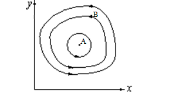
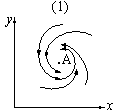
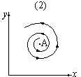
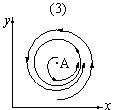
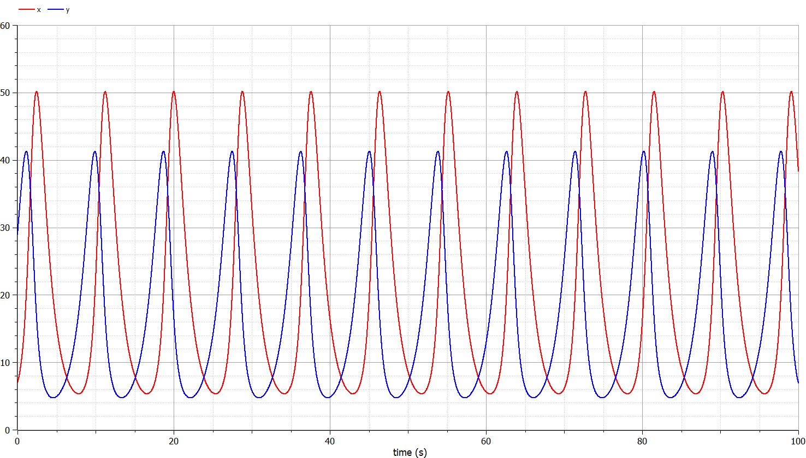
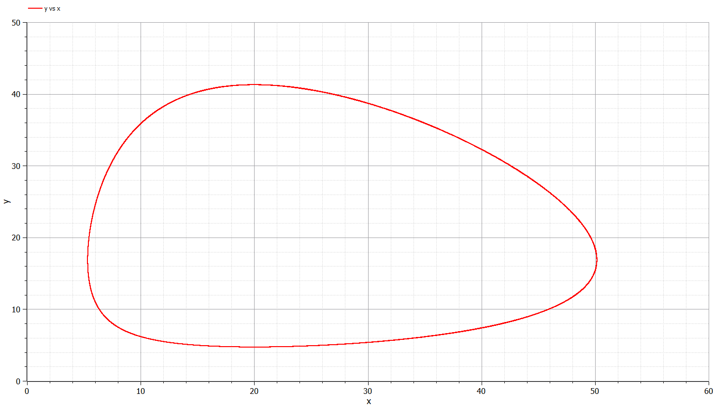
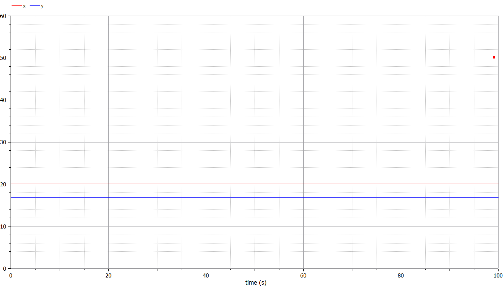

---
## Front matter
lang: ru-RU
title: "Лабораторная работа 5"
author: "Греков Максим Сергеевич"
institute: RUDN University, Moscow, Russian Federation
date: 2021 Москва

## Formatting
mainfont: PT Serif
romanfont: PT Serif
sansfont: PT Serif
monofont: PT Serif
toc: false
slide_level: 2
theme: metropolis
header-includes: 
 - \metroset{progressbar=frametitle,sectionpage=progressbar,numbering=fraction}
 - '\makeatletter'
 - '\beamer@ignorenonframefalse'
 - '\makeatother'
aspectratio: 43
section-titles: true
---

# Цель работы

## Цель работы

Рассмотреть модель - хищник-жертва.

Повысить навыки работы с открытым программным обеспечением для моделирования, симуляции, оптимизации и анализа сложных динамических систем - OpenModelica.

Построить график зависимости численности хищников от численности жертв, а также график изменения численности хищников и численности жертв.

# Описание задачи

## Общее описание задачи

Простейшая модель взаимодействия двух видов типа «хищник — жертва» - модель Лотки-Вольтерры. Данная двувидовая модель основывается на следующих предположениях:

1. Численность популяции жертв x и хищников y зависят только от времени (модель не учитывает пространственное распределение популяции на занимаемой территории)

2. В отсутствии взаимодействия численность видов изменяется по модели Мальтуса, при этом число жертв увеличивается, а число хищников падает

## Общее описание задачи

3. Естественная смертность жертвы и естественная рождаемость хищника считаются несущественными

4. Эффект насыщения численности обеих популяций не учитывается

5. Скорость роста численности жертв уменьшается пропорционально численности хищников

## Формулы

$$
\frac{dx}{dt}=ax(t)-bx(t)y(t)
$$

$$
\frac{dy}{dt}=-cy(t)+dx(t)y(t)
$$

В этой модели $x$ – число жертв, $y$ - число хищников.
 
Коэффициент $a$ описывает скорость естественного прироста числа жертв в отсутствие хищников, $c$ - естественное вымирание хищников, лишенных пищи в виде жертв. 

## Значения коэффициентов

Вероятность взаимодействия жертвы и хищника считается пропорциональной как количеству жертв, так и числу самих хищников $(xy)$. 

Каждый акт взаимодействия уменьшает популяцию жертв, но способствует увеличению популяции хищников (члены $-bxy$ и $dxy$ в правой части уравнения).

## Теоретический материал

{ #fig:001 width=40% }

Математический анализ этой (жесткой) модели показывает, что имеется стационарное состояние (A на рис. 1), всякое же другое начальное состояние (B) приводит к периодическому колебанию численности как жертв, так и хищников, так что по прошествии некоторого времени система возвращается в состояние B.

## Теоретический материал

Стационарное состояние системы (положение равновесия, не зависящее от времени решение) будет в точке: $x_0=\frac{c}{d}, y_0=\frac{a}{b}$. 

Если начальные значения задать в стационарном состоянии $x(0)=x_0, y(0)=y_0$, то в любой момент времени численность популяций изменяться не будет. 

При малом отклонении от положения равновесия численности как хищника, так и жертвы с течением времени не возвращаются к равновесным значениям, а совершают периодические колебания вокруг стационарной точки. 

Амплитуда колебаний и их период определяется начальными значениями численностей $x(0), y(0)$. Колебания совершаются в противофазе.

## Теоретический материал

При малом изменении модели 

$$
\frac{dx}{dt}=ax(t)-bx(t)y(t)+\epsilon f(x,y)
$$

$$
\frac{dy}{dt}=-cy(t)+dx(t)y(t)+\epsilon g(x,y), \epsilon<<1
$$

(прибавление к правым частям малые члены, учитывающие, например, конкуренцию жертв за пищу и хищников за жертв), вывод о периодичности (возвращении системы в исходное состояние B), справедливый для жесткой системы Лотки-Вольтерры, теряет силу. Таким образом, мы получаем так называемую мягкую модель «хищник-жертва».

## Теоретический материал

В зависимости от вида малых поправок $f$ и $g$ возможны следующие сценарии 1-3 (рис. 2,3,4).

{ #fig:002 width=30% }

В случае 1 равновесное состояние A устойчиво. При любых других начальных условиях через большое время устанавливается именно оно.

## Теоретический материал

{ #fig:003 width=30% }

В случае 2 система стационарное состояние неустойчиво. Эволюция приводит то к резкому увеличению числа хищников, то к их почти полному вымиранию. Такая система в конце концов попадает в область столь больших или столь малых значений $x$ и $y$, что модель перестает быть применимой.

## Теоретический материал

{ #fig:004 width=30% }

В случае 3 в системе с неустойчивым стационарным состоянием A с течением времени устанавливается периодический режим. 

## Теоретический материал

В отличие от исходной жесткой модели Лотки-Вольтерры, в этой модели установившийся периодический режим не зависит от начального условия. 

Первоначально незначительное отклонение от стационарного состояния A приводит не к малым колебаниям около A, как в модели Лотки-Вольтерры, а к колебаниям вполне определенной (и не зависящей от малости отклонения) амплитуды.

## Теоретический материал

Возможны и другие структурно устойчивые сценарии (например, с несколькими периодическими режимами).

Вывод: жесткую модель всегда надлежит исследовать на структурную устойчивость полученных при ее изучении результатов по отношению к малым изменениям модели (делающим ее мягкой).

## Теоретический материал

В случае модели Лотки-Вольтерры для суждения о том, какой же из сценариев 1-3 (или иных возможных) реализуется в данной системе, совершенно необходима дополнительная информация о системе (о виде малых поправок $f$ и $g$ в нашей формуле). 

## Теоретический материал

Математическая теория мягких моделей указывает, какую именно информацию для этого нужно иметь. Без этой информации жесткая модель может привести к качественно ошибочным предсказаниям. Доверять выводам, сделанным на основании жесткой модели, можно лишь тогда, когда они подтверждаются исследованием их структурной устойчивости.

# Постановка задачи

## Постановка задачи

Для модели «хищник-жертва»:

$$
\begin{cases}
\frac{dx}{dt}=-0.81x(t)+0.048x(t)y(t) \\   
\frac{dy}{dt}=0.76y(t)-0.038x(t)y(t) \\
\end{cases}
$$

## Постановка задачи

Постройте график зависимости численности хищников от численности жертв, а также графики изменения численности хищников и численности жертв при следующих начальных условиях: 

$$
x_0=7, y_0=29
$$

Найдите стационарное состояние системы.

# Решение задачи

## Решение задачи

{ #fig:005 width=100% }

## Решение задачи

{ #fig:006 width=100% }

## Решение задачи

{ #fig:007 width=100% }

# Вывод 

Рассмотрели модель - хищник-жертва.

Повысили навыки работы с открытым программным обеспечением для моделирования, симуляции, оптимизации и анализа сложных динамических систем - OpenModelica.

Построили график зависимости численности хищников от численности жертв, а также график изменения численности хищников и численности жертв.

## {.standout}
