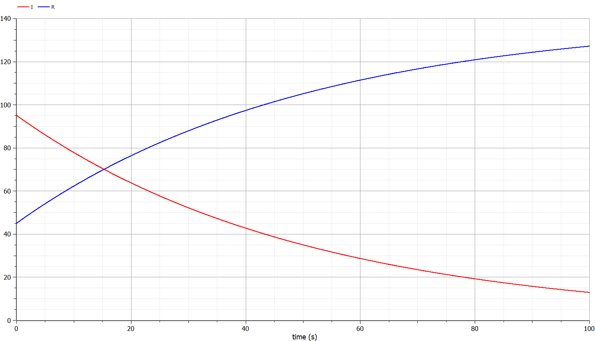
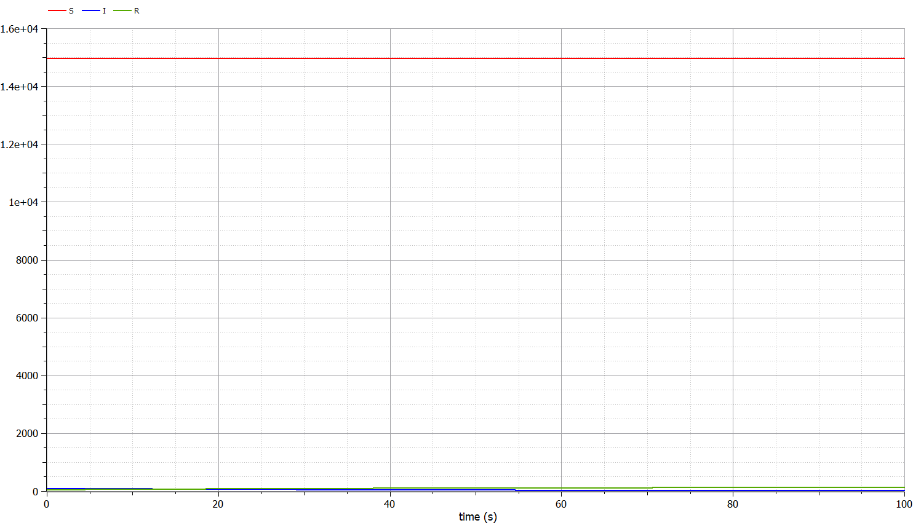

---
## Front matter
lang: ru-RU
title: "Лабораторная работа 6"
author: "Греков Максим Сергеевич"
institute: RUDN University, Moscow, Russian Federation
date: 2021 Москва

## Formatting
mainfont: PT Serif
romanfont: PT Serif
sansfont: PT Serif
monofont: PT Serif
toc: false
slide_level: 2
theme: metropolis
header-includes: 
 - \metroset{progressbar=frametitle,sectionpage=progressbar,numbering=fraction}
 - '\makeatletter'
 - '\beamer@ignorenonframefalse'
 - '\makeatother'
aspectratio: 43
section-titles: true
---

# Цель работы

## Цель работы

Рассмотреть простейшую модель эпидемии.

Повысить навыки работы с открытым программным обеспечением для моделирования, симуляции, оптимизации и анализа сложных динамических систем - OpenModelica.

Построить графики изменения числа особей в каждой из выделенных групп для двух случаев.

# Описание задачи

## Обозначения

Предположим, что некая популяция, состоящая из $N$ особей, (считаем, что популяция изолирована) подразделяется на три группы:

- Первая группа - это восприимчивые к болезни, но пока здоровые особи, обозначим их через $S(t)$. 

- Вторая группа – это число инфицированных особей, которые также при этом являются распространителями инфекции, обозначим их $I(t)$. 

- А третья группа, обозначающаяся через $R(t)$ – это здоровые особи с иммунитетом к болезни.

## Закон изменения параметра S(t)

До того, как число заболевших не превышает критического значения $I^*$, считаем, что все больные изолированы и не заражают здоровых. Когда $I(t)>I^*$, тогда инфицированные способны заражать восприимчивых к болезни особей.

Таким образом, скорость изменения числа $S(t)$ меняется по следующему закону:

$$
\frac{\partial{S}}{\partial{t}} = 
\begin{cases} 
-\alpha S, \ I(t) > I^* \\ 
0, \ I(t) \leq I^* \\ 
\end{cases}
$$

## Закон изменения параметра I(t)

Поскольку каждая восприимчивая к болезни особь, которая, в конце концов, заболевает, сама становится инфекционной, то скорость изменения числа инфекционных особей представляет разность за единицу времени между заразившимися и теми, кто уже болеет и лечится, т.е.:

$$
\frac{\partial{I}}{\partial{t}} = 
\begin{cases} 
\alpha S - \beta I, \ I(t) > I^* \\ 
-\beta I, \ I(t) \leq I^* \\ 
\end{cases}
$$

## Закон изменения параметра R(t)

А скорость изменения выздоравливающих особей (при этом приобретающие иммунитет к болезни)

$$
\frac{\partial{R}}{\partial{t}} = \beta I.
$$

Постоянные пропорциональности $\alpha$ , $\beta$- это коэффициенты заболеваемости и выздоровления соответственно.

## Начальные условия

Для того, чтобы решения соответствующих уравнений определялось однозначно, необходимо задать начальные условия. 

Считаем, что на начало эпидемии в момент времени $t=0$ нет особей с иммунитетом к болезни $R(0)=0$, а число инфицированных и восприимчивых к болезни особей $I(0)$ и $S(0)$ соответственно. 

Для анализа картины протекания эпидемии необходимо рассмотреть два случая: $I(0) \leq I^*$ и $I(0) > I^*$

# Постановка задачи

## Постановка задачи

На одном острове вспыхнула эпидемия. Известно, что из всех проживающих на острове $(N=15 089)$ в момент начала эпидемии $(t=0)$ число заболевших людей (являющихся распространителями инфекции) $I(0)=95$. 

А число здоровых людей с иммунитетом к болезни $R(0)=45$. 

## Постановка задачи

Таким образом, число людей восприимчивых к болезни, но пока здоровых, в начальный момент времени $S(0)=N-I(0)- R(0)$.

Постройте графики изменения числа особей в каждой из трех групп. Рассмотрите, как будет протекать эпидемия в случаях: $I(0) \leq I^*$ и $I(0) > I^*$

# Решение задачи

## Решение задачи

{ #fig:001 width=100% }

## Решение задачи

{ #fig:002 width=100% }

## Решение задачи

{ #fig:003 width=100% }

# Вывод 

## Вывод 

Рассмотрели простейшую модель эпидемии.

Повысили навыки работы с открытым программным обеспечением для моделирования, симуляции, оптимизации и анализа сложных динамических систем - OpenModelica.

Построили графики изменения числа особей в каждой из выделенных групп для двух случаев.

## {.standout}

