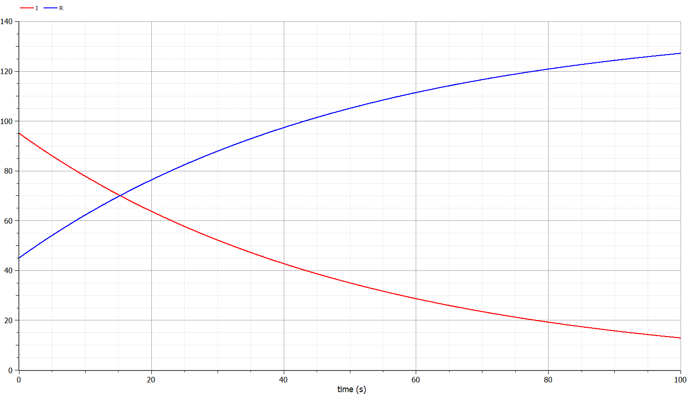
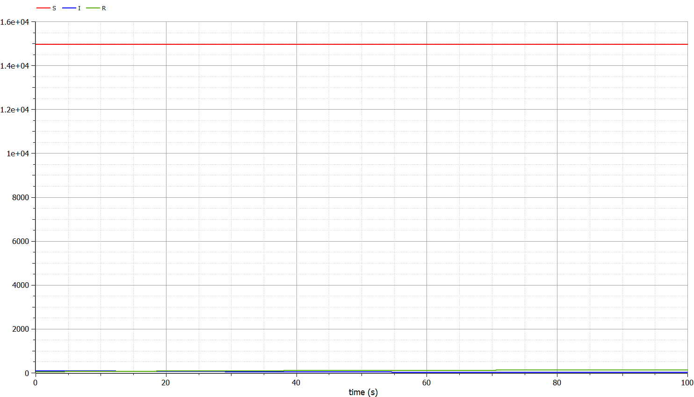
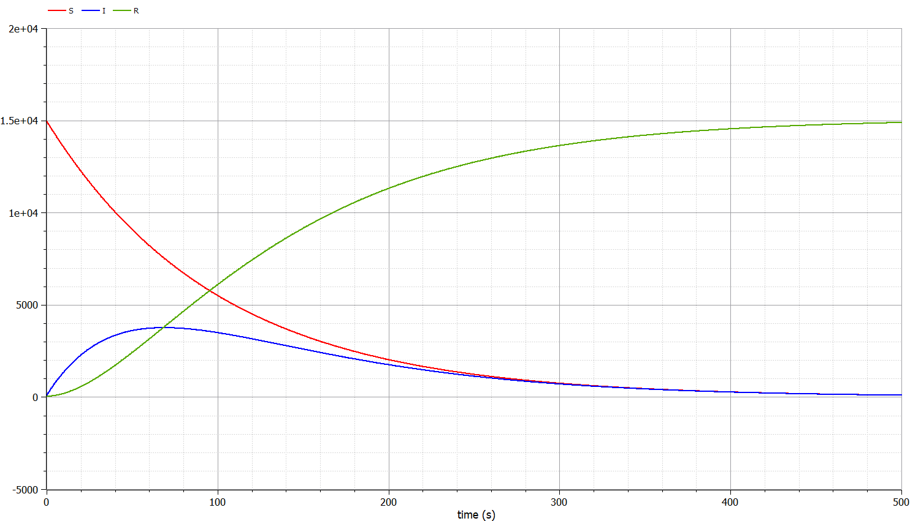

---
# Front matter
lang: ru-RU
title: "Лабораторная работа 6"
subtitle: "Модель эпидемии"
author: "Греков Максим Сергеевич"

# Formatting
toc-title: "Содержание"
toc: true # Table of contents
toc_depth: 2
lof: true # List of figures
lot: false # List of tables
fontsize: 12pt
linestretch: 1.5
papersize: a4paper
documentclass: scrreprt
polyglossia-lang: russian
polyglossia-otherlangs: english
mainfont: PT Serif
romanfont: PT Serif
sansfont: PT Serif
monofont: PT Serif
mainfontoptions: Ligatures=TeX
romanfontoptions: Ligatures=TeX
sansfontoptions: Ligatures=TeX,Scale=MatchLowercase
monofontoptions: Scale=MatchLowercase
indent: true
pdf-engine: lualatex
header-includes:
  - \linepenalty=10 # the penalty added to the badness of each line within a paragraph (no associated penalty node) Increasing the value makes tex try to have fewer lines in the paragraph.
  - \interlinepenalty=0 # value of the penalty (node) added after each line of a paragraph.
  - \hyphenpenalty=50 # the penalty for line breaking at an automatically inserted hyphen
  - \exhyphenpenalty=50 # the penalty for line breaking at an explicit hyphen
  - \binoppenalty=700 # the penalty for breaking a line at a binary operator
  - \relpenalty=500 # the penalty for breaking a line at a relation
  - \clubpenalty=150 # extra penalty for breaking after first line of a paragraph
  - \widowpenalty=150 # extra penalty for breaking before last line of a paragraph
  - \displaywidowpenalty=50 # extra penalty for breaking before last line before a display math
  - \brokenpenalty=100 # extra penalty for page breaking after a hyphenated line
  - \predisplaypenalty=10000 # penalty for breaking before a display
  - \postdisplaypenalty=0 # penalty for breaking after a display
  - \floatingpenalty = 20000 # penalty for splitting an insertion (can only be split footnote in standard LaTeX)
  - \raggedbottom # or \flushbottom
  - \usepackage{float} # keep figures where there are in the text
  - \floatplacement{figure}{H} # keep figures where there are in the text
---

# Цель работы

Рассмотреть простейшую модель эпидемии.

Повысить навыки работы с открытым программным обеспечением для моделирования, симуляции, оптимизации и анализа сложных динамических систем - OpenModelica.

Построить графики изменения числа особей в каждой из выделенных групп для двух случаев.

# Описание задачи

## Обозначения

Предположим, что некая популяция, состоящая из $N$ особей, (считаем, что популяция изолирована) подразделяется на три группы:

- Первая группа - это восприимчивые к болезни, но пока здоровые особи, обозначим их через $S(t)$. 

- Вторая группа – это число инфицированных особей, которые также при этом являются распространителями инфекции, обозначим их $I(t)$. 

- А третья группа, обозначающаяся через $R(t)$ – это здоровые особи с иммунитетом к болезни.

## Закон изменения параметра S(t)

До того, как число заболевших не превышает критического значения $I^*$, считаем, что все больные изолированы и не заражают здоровых. Когда $I(t)>I^*$, тогда инфицированные способны заражать восприимчивых к болезни особей.

Таким образом, скорость изменения числа $S(t)$ меняется по следующему закону:

$$
\frac{\partial{S}}{\partial{t}} = 
\begin{cases} 
-\alpha S, \ I(t) > I^* \\ 
0, \ I(t) \leq I^* \\ 
\end{cases}
$$

## Закон изменения параметра I(t)

Поскольку каждая восприимчивая к болезни особь, которая, в конце концов, заболевает, сама становится инфекционной, то скорость изменения числа инфекционных особей представляет разность за единицу времени между заразившимися и теми, кто уже болеет и лечится, т.е.:

$$
\frac{\partial{I}}{\partial{t}} = 
\begin{cases} 
\alpha S - \beta I, \ I(t) > I^* \\ 
-\beta I, \ I(t) \leq I^* \\ 
\end{cases}
$$

## Закон изменения параметра R(t)

А скорость изменения выздоравливающих особей (при этом приобретающие иммунитет к болезни)

$$
\frac{\partial{R}}{\partial{t}} = \beta I.
$$

Постоянные пропорциональности $\alpha$ , $\beta$- это коэффициенты заболеваемости и выздоровления соответственно.

## Начальные условия

Для того, чтобы решения соответствующих уравнений определялось однозначно, необходимо задать начальные условия. 

Считаем, что на начало эпидемии в момент времени $t=0$ нет особей с иммунитетом к болезни $R(0)=0$, а число инфицированных и восприимчивых к болезни особей $I(0)$ и $S(0)$ соответственно. 

Для анализа картины протекания эпидемии необходимо рассмотреть два случая: $I(0) \leq I^*$ и $I(0) > I^*$

# Постановка задачи

На одном острове вспыхнула эпидемия. Известно, что из всех проживающих на острове $(N=15 089)$ в момент начала эпидемии $(t=0)$ число заболевших людей (являющихся распространителями инфекции) $I(0)=95$. 

А число здоровых людей с иммунитетом к болезни $R(0)=45$. 

Таким образом, число людей восприимчивых к болезни, но пока здоровых, в начальный момент времени $S(0)=N-I(0)- R(0)$.

Постройте графики изменения числа особей в каждой из трех групп. Рассмотрите, как будет протекать эпидемия в случаях: $I(0) \leq I^*$ и $I(0) > I^*$

# Решение задачи

{ #fig:001 width=100% }

{ #fig:002 width=100% }

{ #fig:003 width=100% }

# Код программы

```
model test

parameter Integer N=15089;
parameter Real a=0.01;
parameter Real b=0.02;

Real I(start=95);
Real R(start=45);
Real S(start=N-95-45);

equation
  der(S)=0;
  der(I)=-b*I;
  der(R)=b*I;
  
  //der(S)=-a*S;
  //der(I)=a*S-b*I;
  //der(R)=b*I;
  
end test;
```

# Вывод 

Рассмотрели простейшую модель эпидемии.

Повысили навыки работы с открытым программным обеспечением для моделирования, симуляции, оптимизации и анализа сложных динамических систем - OpenModelica.

Построили графики изменения числа особей в каждой из выделенных групп для двух случаев.