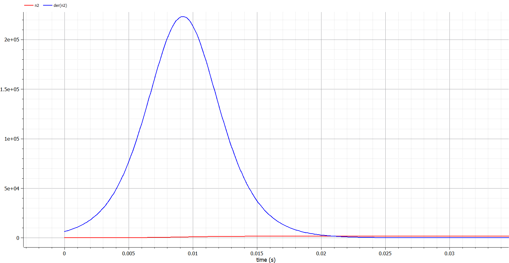
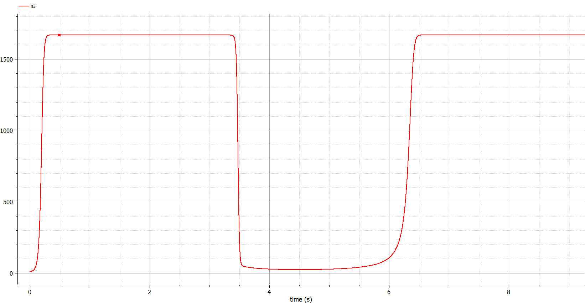
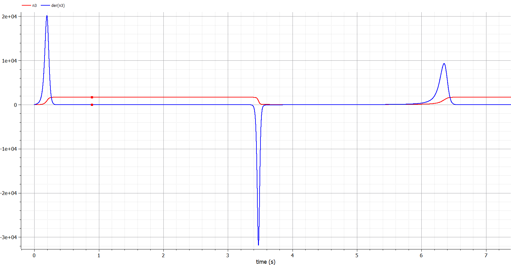

---
## Front matter
lang: ru-RU
title: "Лабораторная работа 7"
author: "Греков Максим Сергеевич"
institute: RUDN University, Moscow, Russian Federation
date: 2021 Москва

## Formatting
mainfont: PT Serif
romanfont: PT Serif
sansfont: PT Serif
monofont: PT Serif
toc: false
slide_level: 2
theme: metropolis
header-includes: 
 - \metroset{progressbar=frametitle,sectionpage=progressbar,numbering=fraction}
 - '\makeatletter'
 - '\beamer@ignorenonframefalse'
 - '\makeatother'
aspectratio: 43
section-titles: true
---

# Цель работы

## Цель работы

Рассмотреть модель рекламной кампании.

Повысить навыки работы с открытым программным обеспечением для моделирования, симуляции, оптимизации и анализа сложных динамических систем - OpenModelica.

Построить графики распространения рекламы для нескольких случаев.

# Описание задачи

## Общее описание

Организуется рекламная кампания нового товара или услуги. Необходимо, чтобы прибыль будущих продаж с избытком покрывала издержки на рекламу.

Вначале расходы могут превышать прибыль, поскольку лишь малая часть потенциальных покупателей будет информирована о новинке. 

Затем, при увеличении числа продаж, возрастает и прибыль, и, наконец, наступит момент, когда рынок насытиться, и рекламировать товар станет бесполезным.

## Обозначения

Предположим, что торговыми учреждениями реализуется некоторая продукция, о которой в момент времени $t$ из числа потенциальных покупателей $N$ знает лишь $n$ покупателей. 

Для ускорения сбыта продукции запускается реклама по радио, телевидению и других средств массовой информации. 

## Обозначения

После запуска рекламной кампании информация о продукции начнет распространяться среди потенциальных покупателей путем общения друг с другом. 

Таким образом, после запуска рекламных объявлений скорость изменения числа знающих о продукции людей пропорциональна как числу знающих о товаре покупателей, так и числу покупателей о нем не знающих.

## Описание величин

Модель рекламной кампании описывается следующими величинами.

Считаем, что $\frac{dn}{dt}$ - скорость изменения со временем числа потребителей, узнавших о товаре и готовых его купить, $t$ - время, прошедшее с начала рекламной кампании, $n(t)$ - число уже информированных клиентов. 

## Описание величин

Эта величина пропорциональна числу покупателей, еще не знающих о нем, это описывается следующим образом: $\alpha_1(t)(N-n(t))$, где $N$ - общее число потенциальных платежеспособных покупателей, $\alpha_1(t)>0$ - характеризует интенсивность рекламной кампании (зависит от затрат на рекламу в данный момент времени).

## Описание величин

Помимо этого, узнавшие о товаре потребители также распространяют полученную информацию среди потенциальных покупателей, не знающих о нем (в этом случае работает т.н. сарафанное радио). Этот вклад в рекламу описывается величиной $\alpha_2(t)n(t)(N-n(t))$, эта величина увеличивается с увеличением потребителей узнавших о товаре. 

## Описание величин

Математическая модель распространения рекламы описывается уравнением:

$$
\frac{dn}{dt}=(\alpha_1(t)+\alpha_2(t)n(t))(N-n(t))
$$

# Постановка задачи

## Постановка задачи

Постройте график распространения рекламы, математическая модель которой описывается следующим уравнением:

1. $\frac{dn}{dt}=(0.133+0.000033n(t))(N-n(t))$

2. $\frac{dn}{dt}=(0.0000132+0.32n(t))(N-n(t))$

3. $\frac{dn}{dt}=(0.8t+0.15sin(t)n(t))(N-n(t))$

## Начальные значения

При этом объем аудитории N=1670 , в начальный момент о товаре знает 12 человек. Для случая 2 определите в какой момент времени скорость распространения рекламы будет иметь максимальное значение.

# Решение задачи

## Решение задачи

{ #fig:001 width=100% }

## Решение задачи

{ #fig:002 width=100% }

## Решение задачи

{ #fig:003 width=100% }

## Решение задачи

{ #fig:004 width=100% }

## Решение задачи

{ #fig:005 width=100% }

## Решение задачи

{ #fig:006 width=100% }

# Вывод 

## Вывод 

Рассмотрели модель рекламной кампании.

Повысили навыки работы с открытым программным обеспечением для моделирования, симуляции, оптимизации и анализа сложных динамических систем - OpenModelica.

Построили графики распространения рекламы для нескольких случаев.

## {.standout}